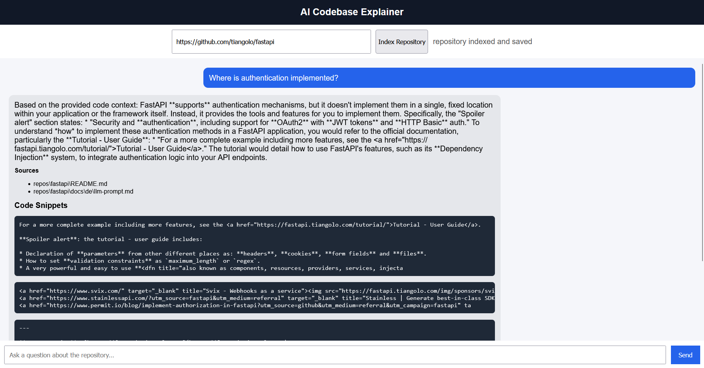
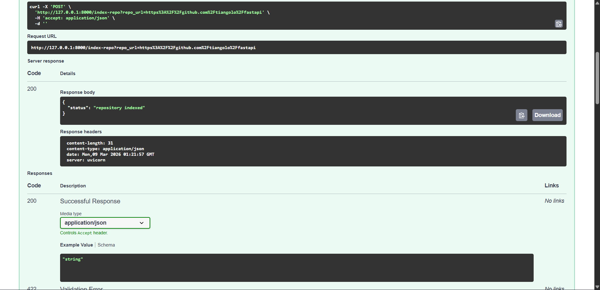

# AI Codebase Explainer


An AI-powered developer assistant that analyzes GitHub repositories and answers questions about the codebase using **Retrieval-Augmented Generation (RAG)**.

The system indexes repository files, performs **semantic code search using embeddings and FAISS**, and generates explanations with **Google Gemini** through a **React chat interface**.

---

## Features

* AI-powered codebase understanding
* Index any public GitHub repository
* Semantic code search using embeddings
* FAISS vector database for fast retrieval
* Google Gemini LLM for explanation generation
* Chat interface for multi-turn questions
* Source file references for answers
* Code snippet highlighting from retrieved context

---

## Architecture

```
User (React Chat UI)
        ↓
FastAPI Backend
        ↓
Repository Ingestion
        ↓
Code Parsing + Chunking
        ↓
Embedding Model
        ↓
FAISS Vector Database
        ↓
Semantic Code Search
        ↓
Gemini LLM
        ↓
Answer + Sources + Code Snippets
```

This architecture follows the **Retrieval-Augmented Generation (RAG)** pattern used in modern AI applications.

---

## Tech Stack

**Frontend**

* React
* JavaScript

**Backend**

* FastAPI
* Python

**AI / ML**

* Sentence Transformers
* FAISS Vector Database
* Google Gemini API

**Other Tools**

* GitHub repository ingestion
* LangChain components
* REST API architecture

---

## How It Works

1. User provides a **GitHub repository URL**.
2. The backend clones the repository.
3. Code files are parsed and split into smaller chunks.
4. Each chunk is converted into **vector embeddings**.
5. Embeddings are stored in a **FAISS vector database**.
6. When a question is asked:

   * FAISS retrieves the most relevant code chunks.
   * The retrieved code is sent to the **Gemini LLM**.
7. The AI generates an explanation with **source references and code snippets**.

---

## Example Usage

### Step 1: Index a Repository

Enter a GitHub repository URL:

```
https://github.com/tiangolo/fastapi
```

Click **Index Repository**.

---

### Step 2: Ask Questions

Example questions:

```
Where is authentication implemented?

How does token validation work?

Explain the dependency injection system.
```

---

### Example Output

```
AI:
Authentication is implemented in the FastAPI security module.

Sources:
fastapi/security.py

Code Snippet:
class OAuth2PasswordBearer:
    def __init__(self, tokenUrl: str):
```

---

## Project Structure

```
ai-codebase-explainer
│
├── app
│   ├── api
│   │   └── routes.py
│   ├── services
│   │   ├── repo_service.py
│   │   ├── query_service.py
│   │   └── embedding_service.py
│   ├── vectorstore
│   │   └── faiss_store.py
│   └── main.py
│
├── frontend
│   └── React application
│
├── vector_db
│   └── FAISS index storage
│
├── repos
│   └── cloned repositories
│
├── requirements.txt
└── README.md
```

---

## Installation

### 1. Clone the repository

```
git clone https://github.com/znixxx30/ai-codebase-explainer.git
cd ai-codebase-explainer
```

---

### 2. Backend Setup

Create a virtual environment:

```
python -m venv venv
```

Activate it:

```
venv\Scripts\activate
```

Install dependencies:

```
pip install -r requirements.txt
```

---

### 3. Add Gemini API Key

Create a `.env` file:

```
GEMINI_API_KEY=your_api_key_here
```

---

### 4. Start Backend

```
uvicorn app.main:app --reload
```

---

### 5. Start Frontend

```
cd frontend
npm install
npm start
```

---
## Screenshots

### Chat Interface


### AI Answer with Sources


## Future Improvements

Potential upgrades:

* streaming AI responses
* improved UI styling
* repository caching
* code syntax highlighting
* support for private repositories

---

## Resume Description

Built an AI-powered developer assistant using **Retrieval-Augmented Generation (RAG)**.
The system indexes GitHub repositories, performs semantic code search using **embeddings and FAISS**, and generates explanations with **Google Gemini LLM**, accessible through a **React chat interface**.

---

## License

MIT License
